# Lab 1

## - Create a free cluster on Atlas.

## - Install Mongo Shell.

## - Load a sample dataset.

## - Explore databases and collections.
----------

### *list of sample databases*
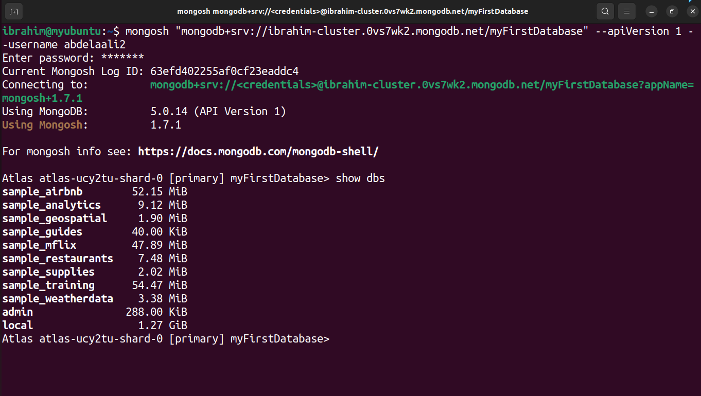

### *list of collections*
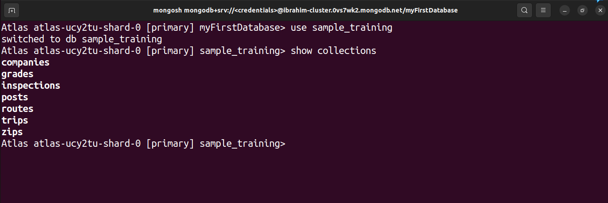

----------
## - Execute find queries using query operators ($ne, $eq, $gt, $regex, etc) and projection.
----------
### *find() method*
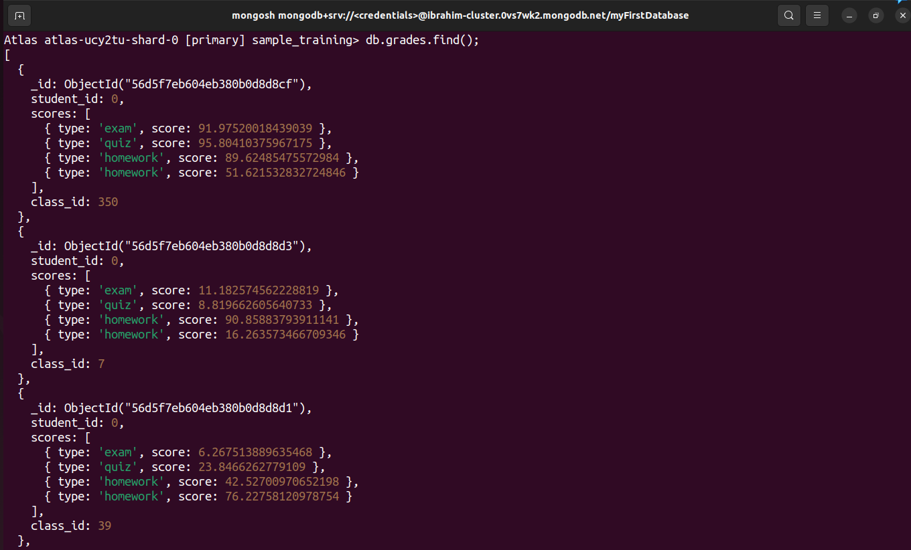

### *$eq Operator*
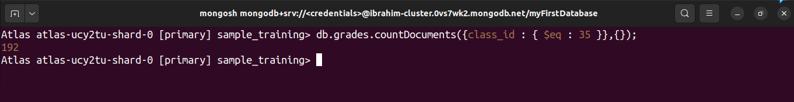

### *$ne Operator*
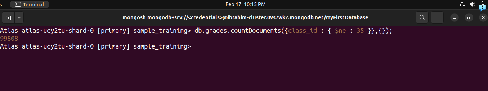

### *$gt Operator*
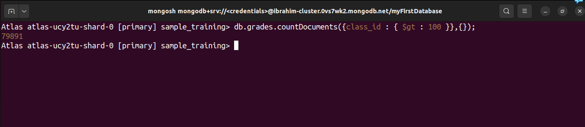

### *$regex Operator*
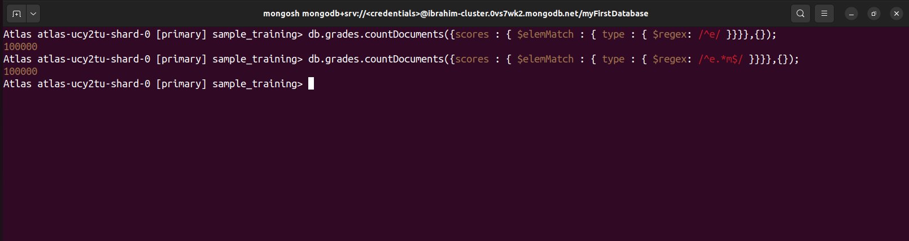

### *Other Operators*
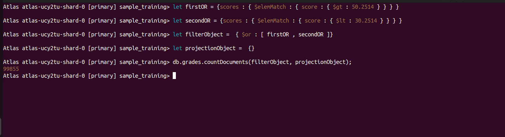

----------
## - Insert arrays and arrays of nested documents.
----------

### *insertOne*
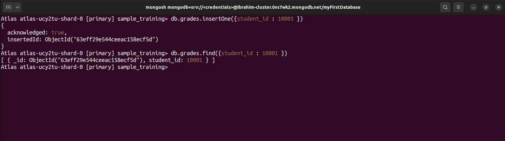

### *insert array via update*
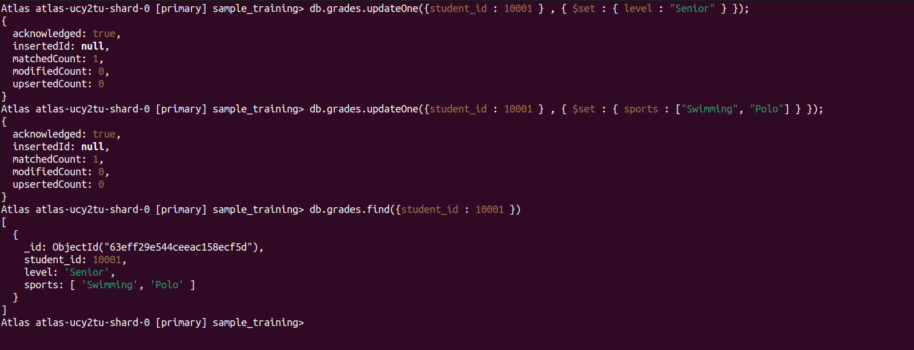

### *insert array of nested documents via update*
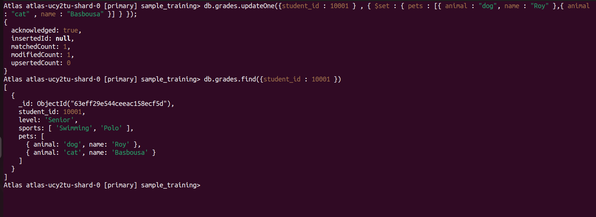

----------
## - Execute find queries on arrays and arrays of nested documents using $elemMatch, $all and $size.
----------

### *$elemMatch*
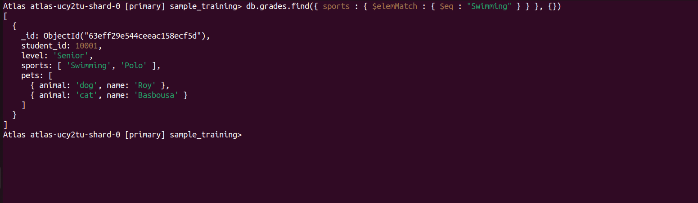

### *$all*
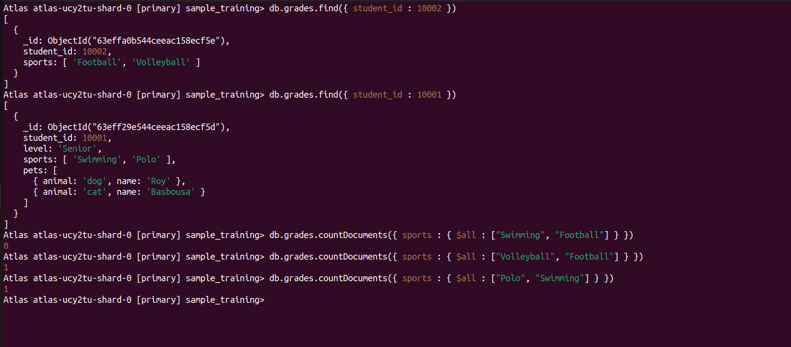

### *$size*
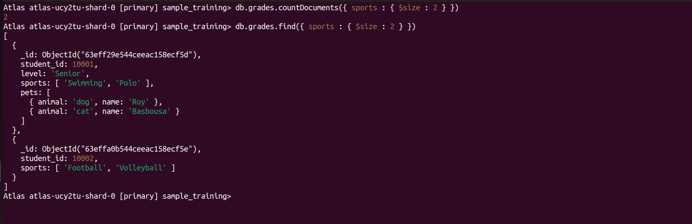

----------
