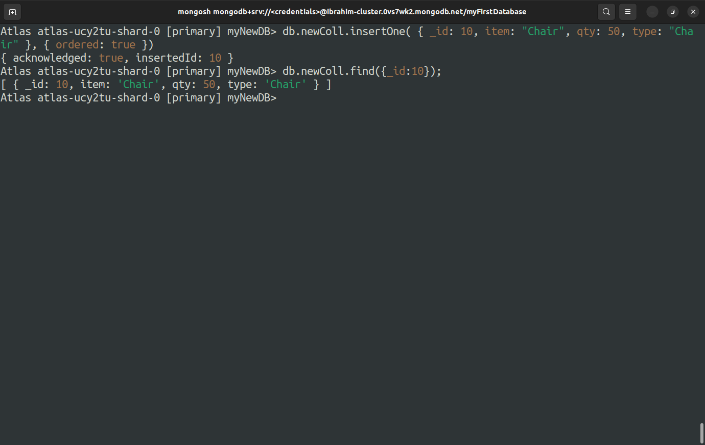

# Lab 2

## - Executing update operations using all update operators ($set, $unset, $push, etc).
----------
>### *Create a new DB and inserting a document in it*
>  

>

>### *$set Operator*
>  

>

>### *Adding more records and $unset Operator*
>  

>

>### *$push Operator*
>  

>

>### *$pop Operator*
>  

>

----------
## - Executing insertion queries with both insertOne and insertMany with ordered flag.
----------

>### *insertOne with order flag = true*
>  

>

>### *insertOne with order flag = false*
>  

>

>### *insertMany with order flag = false*
>  

>

>### *insertMany with order flag = true*
>  

>
----------
## - Executing deleteOne and deleteMany operations.
----------

>### *deleteOne*
>  

>

>### *deleteMany*
>  

>

----------
## - Creating indexes (single field, compound, multi-key and text indexes).
----------

----------
## - Using cursor.explain with different queries and reading and understanding the winningPlan.
----------
