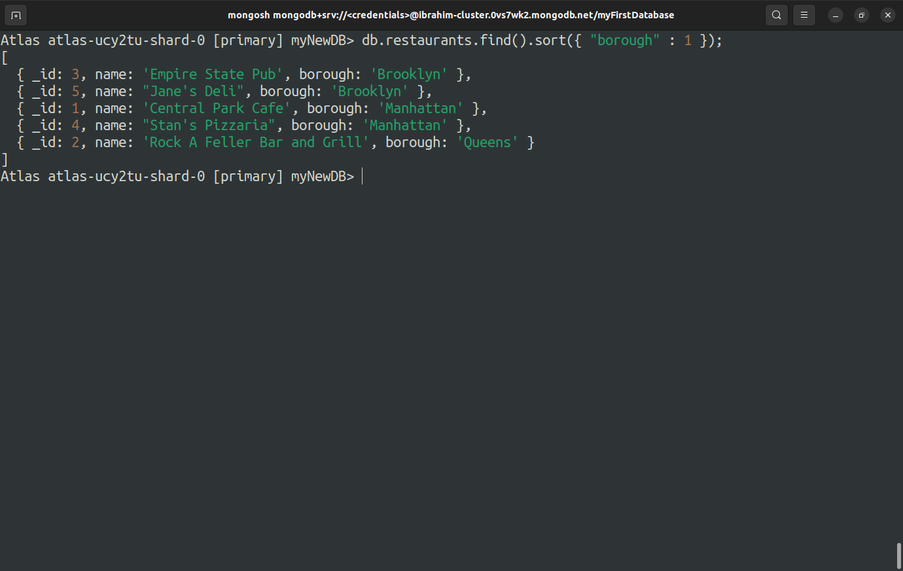
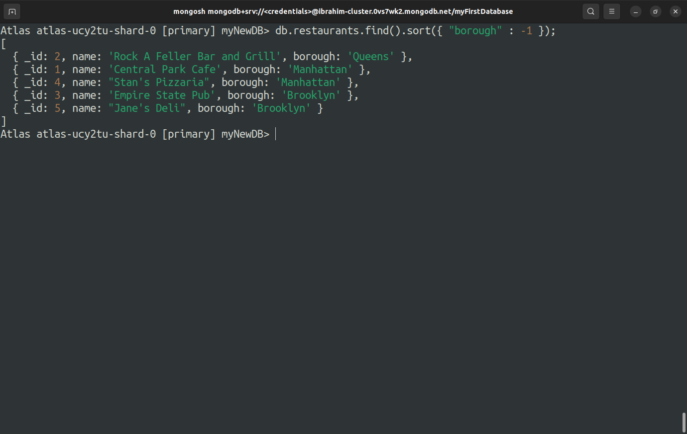
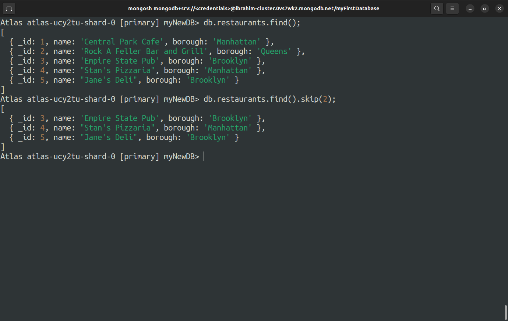
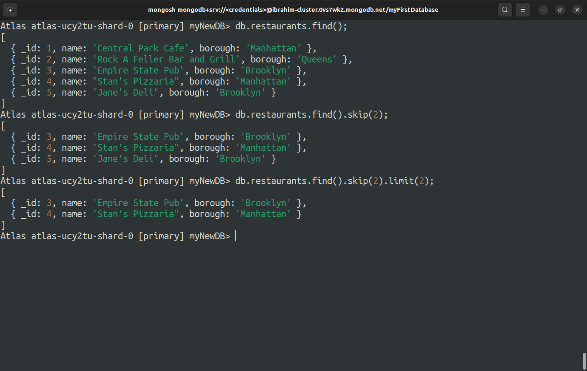
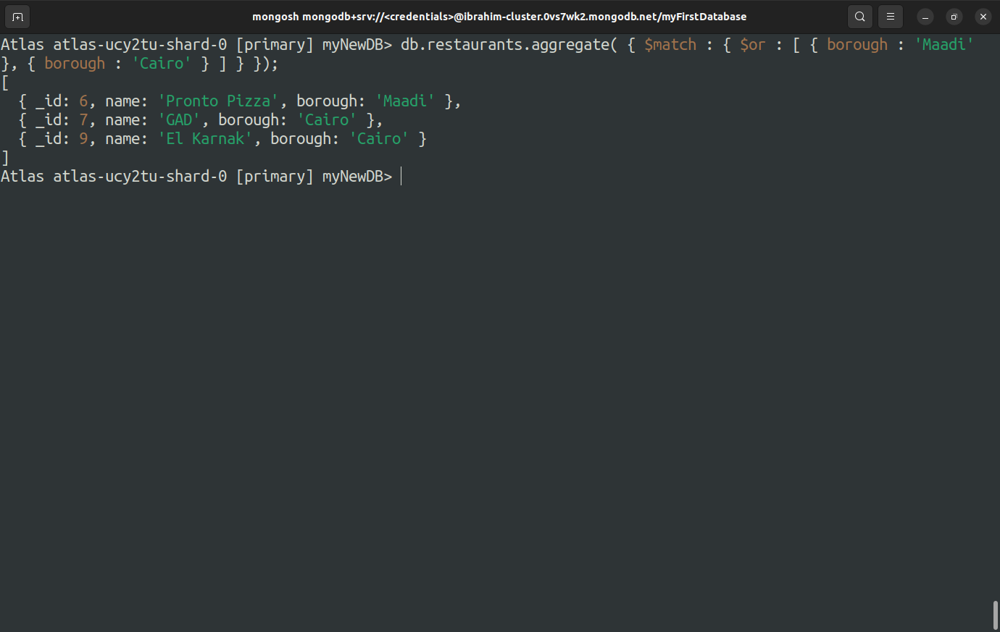
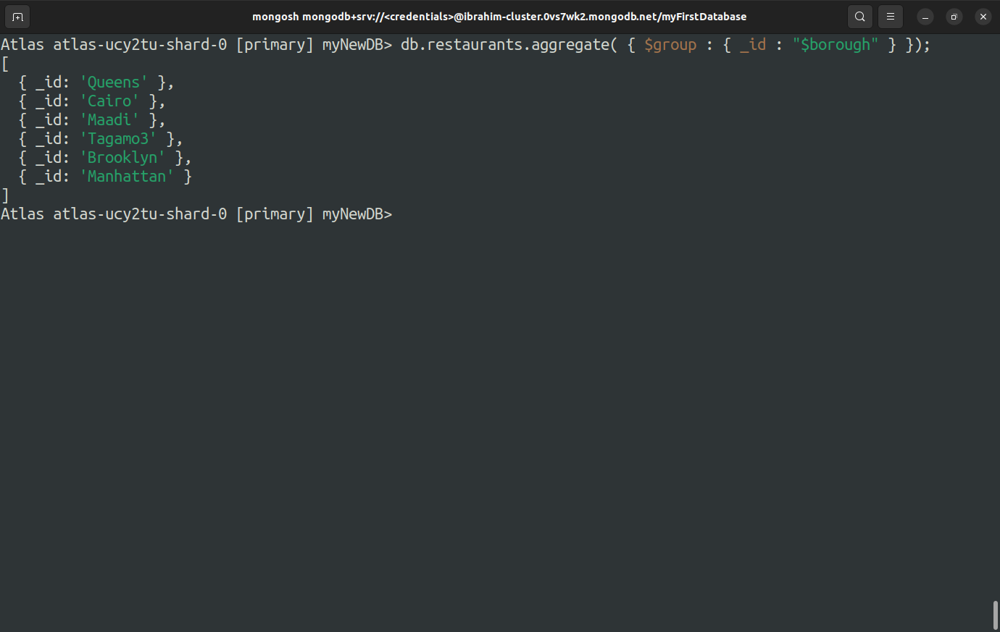
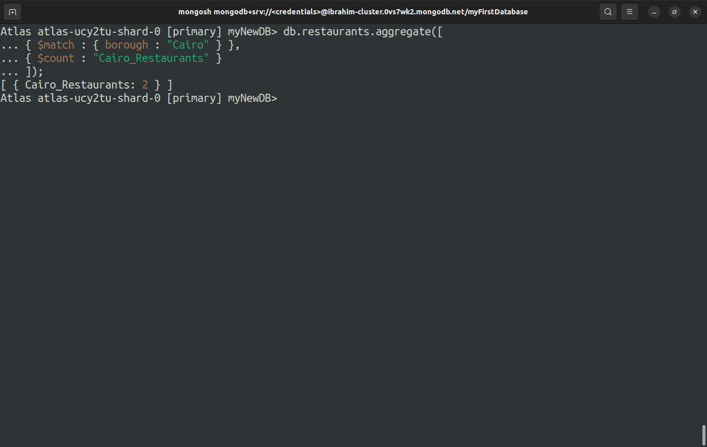
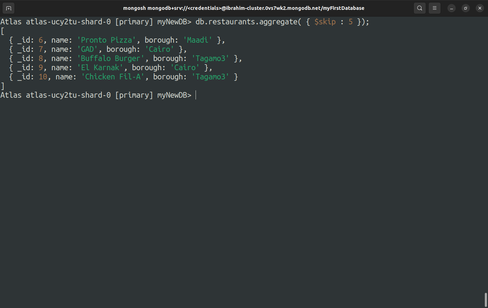
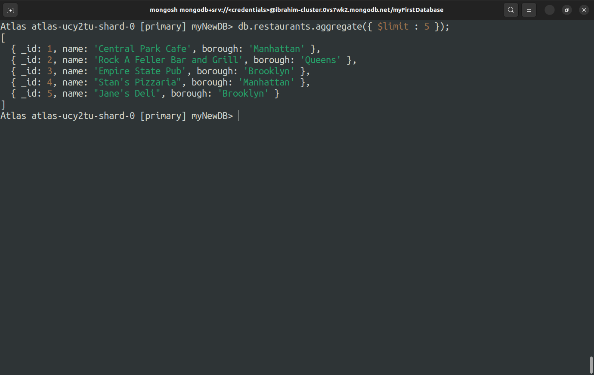
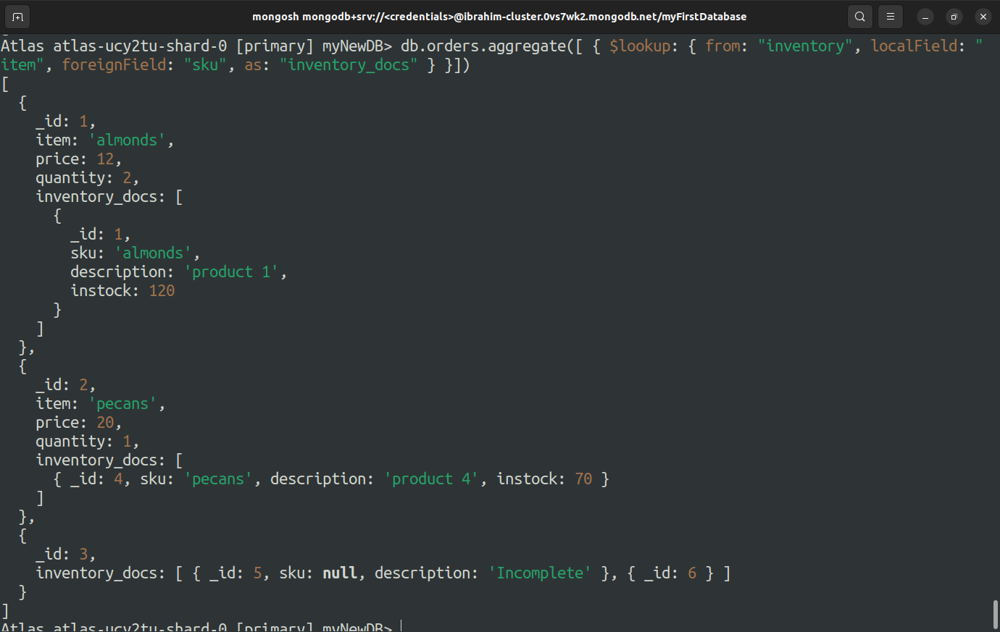

# Lab 3

## - Using sort, skip and limit methods of the cursor.
----------
>### *Sort : 1*
>  

>

>### *Sort : -1*
>  

>

>### *Skip*
>  

>

>### *Limit*
>  

>
----------
## - Running aggregation queries that use multiple stages ($match, $group, $count, $skip, $limit, $lookup, etc).
----------

>### *$match Operator*
>  

>

>### *$group Operator*
>  

>

>### *$count Operator*
>  

>

>### *$skip Operator*
>  

>

>### *$limit Operator*
>  

>

>### *$lookup Operator*
>  

>
----------
## - Using $project and $addFields with operator expressions such as ($getField, $first, $concat, $dateToString, etc).
----------

>### *$getField Expression Operator*
>  

>

>### *$first Expression Operator*
>  

>

>### *$concat Expression Operator*
>  

>

>### *$dateToString Expression Operator*
>  

>

----------
## - Reading and using $unwind.
----------

----------
## - Using array update operators (\$ , \$[], \$[\<identifier>]).
----------

----------